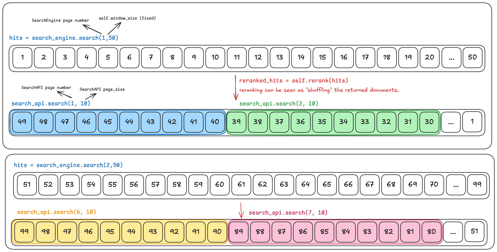

# Introduction

When implementing a search API (`SearchAPI`) we need to interact with a search engine (`SearchEngine`) to retrieve the hits that match the user query. The search engine will return the hits in pages, where each page contains a number of hits (page size). The user can control which page and page size they want to retrieve. But sometimes the page and page size values that we send to the search engine are not the same as the ones that the user requested. In this problem set we explore two such cases. Let's define the `SearchEngine` class, which we **don't control** (we can't change its code).


```python
class SearchEngine:
    def __init__(self, n_list: int):
        self.hits = [str(i) for i in range(n_list)]

    def search(self, engine_page: int, engine_page_size: int) -> list:
        # engine_page starts from 1.
        return self.hits[(engine_page-1) * engine_page_size: engine_page * engine_page_size]

# Example usage
search_engine = SearchEngine(10000)
```

For practical purposes, we can initialize the engine with a large integer which simulates the collection of hits stored in the search engine.

You can try a few examples to understand how the `SearchEngine` works:

```python
print(search_engine.search(1, 10)) # Should get [0, 1, ..., 9]
print(search_engine.search(2, 10)) # Should get [10, 11, ..., 19]
print(search_engine.search(3, 10)) # Should get [20, 21, ..., 29]
```


# 1. Window paginator

When using a reranker, we need to retrieve more hits than the user requested to build the final ordering. This is because there can be hits that are very relevant for the query but are not scored in the top `page_size` hits returned by the search engine.

However, we should return only the amount of hits that the user requested as well as to respect the page number they selected.

Implement a `SearchAPI` that **always** retrieves `window_size` hits from the `SearchEngine`, then call `self.rerank` on these results, and finally return only the amount of hits that the user requested.

```python
class SearchAPI:
    def __init__(self, search_engine: SearchEngine, window_size: int):
        self.search_engine = search_engine
        self.window_size = window_size

    def rerank(self, hits):
        return sorted(hits, key=lambda x: int(x), reverse=True)

    def search(self, page: int, page_size: int) -> list:
        # page starts from 1.
        raise NotImplementedError

# Example usage
search_api = SearchAPI(search_engine, 50)
print(search_api.search(1, 10))  # Should get [49, 48, ..., 40]
print(search_api.search(2, 10))  # Should get [39, 38, ..., 30]
print(search_api.search(3, 10))  # Should get [29, 28, ..., 20]
print(search_api.search(4, 10))  # Should get [19, 18, ..., 10]
print(search_api.search(5, 10))  # Should get [9, 8, ..., 0]
print(search_api.search(6, 10))  # Should get [99, 98, ..., 90]
print(search_api.search(7, 10))  # Should get [89, 88, ..., 80]
```

*Hint*: You can assume that `window_size` is divisible by `page_size`.

To validate your solution, run the following tests:

```python
class Tests:
    def __init__(self, search_engine: SearchEngine, impl_cls):
        self.search_engine = search_engine
        self.impl_cls = impl_cls

    def run(self, cases):
        for case in cases:
            result = self.impl_cls(self.search_engine, case[0]).search(case[1], case[2])
            assert (
                result == case[3]
            ), f"Result for ({case[0]},{case[1]},{case[2]}) was {result}, expected {case[3]}"
        print("All tests passed!")


Tests(search_engine, SearchAPI).run([
    (50, 1, 10, list(map(str,reversed(range(40,50))))),
    (50, 2, 10, list(map(str,reversed(range(30,40))))),
    (50, 3, 10, list(map(str,reversed(range(20,30))))),
    (50, 4, 10, list(map(str,reversed(range(10,20))))),
    (50, 5, 10, list(map(str,reversed(range(0,10))))),
    (50, 6, 10, list(map(str,reversed(range(90,100))))),
    (50, 7, 10, list(map(str,reversed(range(80,90))))),
    (50, 8, 10, list(map(str,reversed(range(70,80))))),
    (50, 9, 10, list(map(str,reversed(range(60,70))))),
    (50, 10 ,10 ,list(map(str,reversed(range(50,60))))),
])
```

## Extra

What happens if `window_size` is not divisible by `page_size`? How would you handle this case?

# 2. Chunk paginator

For performance reasons, sometimes it's better to batch the requests made to a search engine to spread out the load. The requester will still want to get the number of hits they have requested.

Implement a `SearchAPI` that retrieves the number of hits that the user requested, but when calling the `SearchEngine`, you can only request **at most** `chunk_size` hits.

```python
class SearchAPI:
    def __init__(self, search_engine: SearchEngine, chunk_size: int):
        self.search_engine = search_engine
        self.chunk_size = chunk_size

    def search(self, page: int, page_size: int) -> list:
        # page starts from 1.
        raise NotImplementedError

# Example usage
search_api = SearchAPI(search_engine, 25)
print(search_api.search(1, 120)) # Should get [0, 1, ..., 119]
print(search_api.search(2, 120)) # Should get [120, 121, ..., 239]

search_api_2 = SearchAPI(search_engine, 10)
print(search_api_2.search(1, 22)) # Should get [0, 1, ..., 21]
print(search_api_2.search(2, 22)) # Should get [22, 23, ..., 43]
print(search_api_2.search(3, 22)) # Should get [44, 45, ..., 65]
print(search_api_2.search(4, 22)) # Should get [66, 67, ..., 87]
print(search_api_2.search(5, 22)) # Should get [88, 89, ..., 109]

search_api_3 = SearchAPI(search_engine, 50)
print(search_api_3.search(1, 200)) # Should get [0, 1, ..., 199]

search_api_4 = SearchAPI(search_engine, 200)
print(search_api_4.search(1, 50)) # Should get [0, 1, ..., 49]
print(search_api_4.search(2, 50)) # Should get [50, 51, ..., 99]
print(search_api_4.search(3, 50)) # Should get [100, 101, ..., 149]
print(search_api_4.search(4, 50)) # Should get [150, 151, ..., 199]
```

*Hit*: You can think of the solution in 2 parts: 1. What pages should you request from the `SearchEngine`? 2. How should the hits returned from the `SearchEngine` be sliced to return the correct hits to the user? You can request more hits than what the `SearchAPI` will need if that makes the solution simipler.

*Hint2*: Manually write down how the results returned from the `SearchEngine` will look for some cases before you start coding.

To validate your solution, run the following tests:

```python
Tests(search_engine, SearchAPI).run([
    (25, 1, 120, list(map(str, range(0, 120)))),
    (25, 2, 120, list(map(str, range(120, 240)))),
    (10, 1, 22, list(map(str, range(0, 22)))),
    (10, 2, 22, list(map(str, range(22, 44)))),
    (10, 3, 22, list(map(str, range(44, 66)))),
    (10, 4, 22, list(map(str, range(66, 88)))),
    (10, 5, 22, list(map(str, range(88, 110)))),
    (50, 1, 200, list(map(str, range(0, 200)))),
    (200, 1, 50, list(map(str, range(0, 50)))),
    (200, 2, 50, list(map(str, range(50, 100)))),
    (200, 3, 50, list(map(str, range(100, 150)))),
    (200, 4, 50, list(map(str, range(150, 200)))),
])
```

## Extra: Refactoring

Can you think of a structure that can be reused for any `SearchEngine` and `SearchAPI` class?
